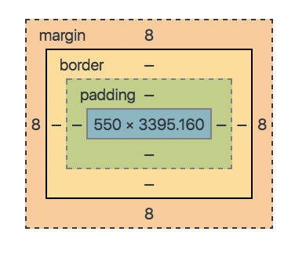

###### Front-end Development School

#DAY 08

##Team Activity Log
**[Kakao](http://kakaocorp.com/main)**
* footer 영역이 창 크기를 확대해야지만 보임. 사용자입장에서 수정이 필요해 보임
* `div`보다는 `article` 로 구조화하는 것이 좋을것 같음
* sectioning 요소 안에 sectioning 요소가 들어갈 수 있음
* `main` 요소는 `body`안에 바로 한번만 쓰고 다른 sectioning 요소 안에는 들어갈 수 없음

```html
<main>
    <section>
          <h2></h2>
          <article><h3></h3></article>
          <article><h3></h3></article>
    </section>
    <section>
          <h2></h2>
          <article><h3></h3></article>
          <article><h3></h3></article>
    </section>
</main>
```

* 구조화 순서는 `header`,`footer`를 묶어주고 콘텐츠들은 `main`안에 구조화

-----
<br>  
## CSS Box Model


* Normal flow - 변경되면 전체적인 UI에 영향을 줌
* Outline - UI에 영향을 주지 않음, 시각적인 효과만 제공

<br>  
#### margin
> 색이 적용되지 않는다. 투명함

> 음수 값을 사용할 수 있다. 접점에서 사용

**margin collapsing** 
  * 위아래는 겹치는데, 좌우는 겹치지 않는다.
  * 세로로 2개 이상 블록요소 마진이 만났을 때, 마진이 겹쳐지는 현상
  * 부모 요소 안에 자식 요소의 경우, 부모에게 패딩, 보더 값이 없을 때 발생

* 비표준 IE에서는 margin: auto; 설정이 적용되지 않음
```css
/* 대체 방식 */
.parent {
  text-align: center;
}
.child {
  text-align: left;
}
```

**부모 요소에 `padding`, `border` 값이 없을 때.. 자식 요소의 `margin` 값은 어떻게 설정되나?**
* 부모 요소 바깥으로 `margin` 영역에 자식 요소의 `margin` 값이 적용됨
* 부모 요소에  `padding`이나 `border`이 존재하면 부모의 `padding`이나 `border` 안쪽 영역으로 자식 요소의 `margin` 값이 적용됨

<br>
#### padding
> 색이 적용되고, 양수 값만 사용 가능

> contente와 border 사이를 벌리는데 사용

> 각 요들은 대각선으로 ??? 별도 그릴 수 있음

<br>
#### border

`border-style `
* 테두리 모양 설정 - solid:  직선, dashed: 파선, dotted: 점선, double: 이중괘선, inset, outset

`border-width`
* 테두리 두꼐 설정

`border-color`
* 테두리 색상 설정

>속기형 작성시에 순서는 상관 없음

```css
border: style width color;
border: 10px solid #0080FF;
```

<br>
#### Block, Inline Box
* 가상요소는 기본적으로 Inline Box

* 모든 텍스트는 라인박스를 가진다. 좌우로는 마진 패딩 가능하지만 세로 간격 조절은 안됨.
* 표준에서 `width`는 `content`까지 잡고, IE가 비표준에서는 `border`까지 잡는다. 
* `Doctype`으로 표준을 꼭 쓰자!!!

* `auto`는 브라우저의 값을 자동으로 사용, `position`을 쓰면 폭이 줄어드는데 넓혀 주기 위해서 쓴다.
* `inherit` - 부모의 값을 상속 받는다.
  * `input`요소는 기본적으로 부모로 부터 상속을 받지 않기 때문에 상속 받기 위해서 `inherit`을 사용한다.

`max-width`, `min-width`, `max-height`, `min-height`
  * 콘텐츠의 속성에 따라 보기 쉬운 형태를 유지하기 위해 적용한다.

##### 중앙 정렬
* `line-height` 
  * `font-size`와 텍스트 위아래 여백값을 더한 총합값
  * 부모 박스의 높이 만큼 `line-height`를 주면 세로 중앙 정렬됨.
    * 이 방법은 텍스트가 한줄일때만 가능, 한줄을 넘기면 겹
```css
.paren {
  height: 10em;
  line-height: 10em;
}
```

* `img` 밑에 알 수 없는 공간이 생겨서 세로 중앙 조절하기 어렵다.
  * `img` 요소에 `vertical-align : middle`를 준다. 
  * `display: inline, table-cell` 에만 `vertical-align`이 적용된다.

  [그외 중앙 정렬 방법](www.student.oulu.fi/~lauirai/www/css/middle)

<br>
## Size 단위

#### `em`
* equal M
* `em`은 중첩된 구조 내에서 사용하기 어려움, 나를 포함한 부모로 부터 값을 기준으로 변경됨

#### `rem`
* root equal M
* Root 요소(HTML) 값에 대한 상대 값
* 디바이스에 따라 Root Element 의 기본 크기만 변경하면 됨, 유지보수가 가장 편리

#### `vw`, `vh`, `vmin`, `vmax`

* viewport - 디바이스의 화면
* **vh를 활용하는 경우** - `%`가 부모에 대해서 올바로 동작하지 않는 경우가 있어 이때 주로 사용한다. 
* 대체 기술 - polyfill , 하위 브라우저 지원
* 모바일에서 사용하기 적절
[viewport units, caniuse](http://caniuse.com/#search=vw)

[viewport units, css-tricks](https://css-tricks.com/viewport-sized-typography/)

<br>
## Font, Text
* Font - character, 크기, 색상, 모양 ...
* Text - paragraph, 정렬, 자간, 행간 ...

#### `font-weight`
* 숫자를 인식하지 못하는 하위 브라우저의 하위 호환 고려를 위해서 제공
* 100 - 400(Normal) - 700(bold) - 900(bolder) 

```css
  font-weight: bolder; 
  font-weight: 900; 
```

<br>
## Media Query

* CSS3 미디어 쿼리  -  `@media 환경 and 조건1 and 조건2`
* 중단점(Breakpoint) 설계(Design)
* `--1-- (600) --2-- (1000) --3--`

* 현재 모바일 시장이 훨씬 크다.  모바일이 데스크탑의 4배 이상, media 쿼리를 쓰는 경우 모바일 first로 설계하는 것이 좋다.

* `only` 최신 브라우저에만 지원하는 경우 사용
  * ie 에서 media screen은 지원하지만 쿼리는 지원하지 않음

```css
@media only screen and (max-width: 37.5em) {
  body::before {
    content: '스크린의 폭이 600px보다 작습니다.';
  }
  body { background: #000; color: #fff;}
}
@media only screen and (min-width: 37.5em) and (max-width: 62.5em) {
  body::before {
    content: '스크린의 폭이 600px보다 크고 1000px 보다 작습니다.';
  }
  body { background: #888; }
}
@media only screen and (min-width: 62.5625em) {
  body::before {
    content: '스크린의 폭이 1000px보다 큽니다.';
  }
  body { background: #fff; }
}
```

>  뭔가 깨지는 문제가 생기면 Doctype 위에 뭐가 없나 꼭 확인하자!!!


