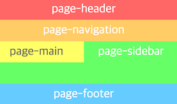

###### Front-end Development School

#DAY 10

## CSS 레이아웃 속성
* `img` 와 함께 있는 `p`를 `img`의 폭을 계속 여백으로 가져가고 싶을 때 
  * `p`안에  `overflow: hidden;` 속성을 주면된다... 이유는 알 수 없음
  * 유지보수를 위해 부모를 중심으로 아래 요소들이 영향을 받을 수 있도록 별도의 클래스로 관리하여 속성을 주는 것이 좋다.

* `clear`
    * `none` `left` `right` `both`
    * 앞 요소의 `float` 속성을 해제하기 위해 사용한다.
    * clearboth.org

* `float`
  * `float`이 적용된 요소 main은 적용되지 않은 요소 sidebar 위에 떠있는 상태이지만 텍스트 요소들은 `float`된 요소 주변에 배치된다.
  * 모든 요소가 `float`되면 부모의 높이 값이 없어져 버린다.
  * `float`을 적용해도  `img`의 알수없는 빈공간이 사라짐.



* **부모가 `float`된 자식을 감싸는 방법**
  1. 부모에게도 `float`을 적용한다. 
    * **부모에게 `float`을 적용하면 자식 요소 만큼 높이가 생긴다는것만 기억하자.**
    * 좋지 않은 방법 무한 `float`에 빠지게 됨...
    * 가운데 정렬도 할 수 없음
    * 근본적인 해결책이 될 수 없음. 쓰지 말아라.
  2. 마지막 자식 요소 뒤에 `clear: both` 속성을 준 요소를 추가한다.
    * 표현을 위해서 무의미한 코드를 추가한 것이다.
    * 이것도 좋지 않은 방법...
  3. 부모 요소에 `overflow: auto` or `overflow: hidden`를 속성을 적용한다.
    * 간단하고 실무에서 많이 사용하는 방법이기는 하지만...
    * 부모 요소에서 컨텐츠가 넘치면 안보이게 됨.
  4. `clearfix`클래스로 관리하는 방법
```css
/*Legacy Method v1*/
.clearfix::after {
  content: 'pseudo element';
  display: block;
  clear: both;
  visibility: hidden;
  height: 0;
}

/*Legacy Method v1.1*/
.micro-clearfix::after {
  content: '';
  display: block;
  clear: both;
}

/*New Method*/
.mcf::before, .mcf::after {
  content: '';
  display: table;
}
.mcf:: after {
  clear: both;
}
```

-

## of-type 선택자
* 클래스만 써서 판별하지 않고 같은 Element안에서 해당 클래스를 찾게 된다.